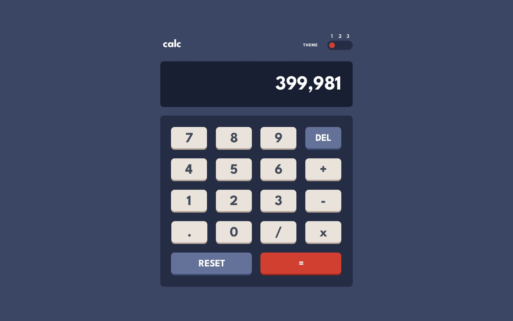

# Calculator App

This is a solution to the [Calculator app challenge on Frontend Mentor](https://www.frontendmentor.io/challenges/calculator-app-9lteq5N29). Frontend Mentor challenges help you improve your coding skills by building realistic projects.

## Table of Contents

- [Overview](#overview)
  - [The Challenge](#the-challenge)
  - [Screenshot](#screenshot)
  - [Links](#links)
- [My Process](#my-process)
  - [Built With](#built-with)
  - [What I Learned](#what-i-learned)
  - [Continued Development](#continued-development)
- [Author](#author)

## Overview

### The Challenge

The challenge was to build a calculator app with basic arithmetic operations and toggle themes.

Users should be able to:

- Perform basic arithmetic operations (addition, subtraction, multiplication, division)
- Reset the calculator to its initial state
- Toggle between different themes (light, dark, and neon)
- View the optimal layout for the app depending on their device's screen size

### Screenshot

### Links

- Solution URL: [https://github.com/bennahiaoualid/calculator-app-main](https://github.com/bennahiaoualid/calculator-app-main)
- Live Site URL: [https://bennahiaoualid.github.io/calculator-app-main/](https://bennahiaoualid.github.io/calculator-app-main/)

## My Process

### Built With

- Semantic HTML5 markup
- CSS custom properties
- Flexbox
- CSS Grid
- Mobile-first workflow
- JavaScript

### What I Learned

In this project, I learned how to build a functional calculator app using HTML, CSS, and JavaScript. I practiced implementing arithmetic operations, handling user input, and updating the display accordingly. Additionally, I gained experience in creating responsive layouts, implementing theme toggling, and ensuring a smooth user experience.

### Continued Development

Moving forward, I plan to continue enhancing my skills in JavaScript, focusing on improving code organization, modularization, and error handling. I also aim to explore more advanced JavaScript concepts like working with APIs and implementing more complex calculations. Additionally, I will continue to improve my responsive web design skills and accessibility practices.

## Author

- Frontend Mentor - [@bennahiaoualid](https://www.frontendmentor.io/profile/bennahiaoualid)
- GitHub - [@bennahiaoualid](https://github.com/bennahiaoualid)